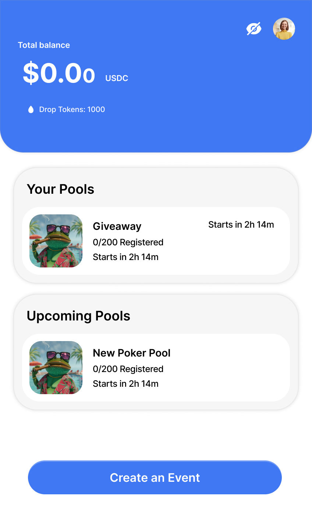

# <a name="top"></a>

<div align="center">
  
  
  <h2>Demystifying Web3 Social Finance: Making Group Funding & Giveaways Simple & Engaging on Base.</h2>
  <p><strong>Pool Mini: Create and participate in token giveaways and funding pools directly within Farcaster!</strong></p>
  
  
  
  <p>
    <a href="https://nextjs.org" target="_blank" rel="noopener noreferrer"></a>
    <a href="https://base.org" target="_blank" rel="noopener noreferrer"></a>
    <a href="https://docs.base.org/builderkits/onchainkit" target="_blank" rel="noopener noreferrer"></a>
    <a href="https://docs.base.org/builderkits/minikit/overview" target="_blank" rel="noopener noreferrer"></a>
    <a href="https://github.com/Pool-Escrow/pool-mini-app/blob/main/LICENSE" target="_blank" rel="noopener noreferrer"></a>
  </p>
  <p>
    <a href="https://deepwiki.com/Pool-Escrow/pool-mini-app" target="_blank" rel="noopener noreferrer"></a>
  </p>
</div>

## 🌟 What is Pool Mini?

Pool Mini demystifies web3 social finance, making group funding and token giveaways simple, engaging, and accessible. Born from the need to simplify budget management and fund dispersal in web3—especially for multi-recipient scenarios like hackathon bounties or community events—Pool Mini brings this power directly into the Farcaster ecosystem.

As a Farcaster Mini-App, it leverages Pool's core functionalities to enhance community interaction. Influencers, communities, and projects can easily launch giveaways, crowdfund initiatives, or reward user engagement directly within the Farcaster feed. With an intuitive UX, AI-assisted parameter suggestions (planned), and quick onboarding, Pool Mini aims to make group funding fun and straightforward for both crypto-natives and newcomers.

This project is a [Next.js](https://nextjs.org) application bootstrapped with `create-onchain --mini`, enhanced with [MiniKit](https://docs.base.org/builderkits/minikit/overview) and [OnchainKit](https://www.base.org/builders/onchainkit) for seamless Base integration, and styled with [Tailwind CSS](https://tailwindcss.com).

<div align="right" style="margin-top: 1rem;">
  <a href="#top" style="font-size: 0.8rem; color: #58a6ff;">↑ Go to top</a>
</div>

## 🚀 Deployments

For information about deployed contracts and deployment history, see our [Deployment Documentation](./docs/deployment.md).

- **Latest Base Mainnet Deployment (`Pool.sol`)**: [`0xA2cD9Ccd89C3c8760A701DaDD11174393443E495`](https://basescan.org/address/0xa2cd9ccd89c3c8760a701dadd11174393443e495)
- **Latest Base Sepolia Testnet Deployment (`Pool.sol`)**: [`0xD571c6e319D13637A1DfF6F6e9fdb8d2803af3aE`](https://sepolia.basescan.org/address/0xd571c6e319d13637a1dff6f6e9fdb8d2803af3ae)
- _(Refer to `deployment.md` for Droplet and other token contract addresses.)_

## 🚀 Getting Started

### Prerequisites

- [Bun](https://bun.sh/docs/installation) (v1.0+ recommended)
- [Git](https://git-scm.com/)
- A Web3 wallet (e.g., MetaMask, Coinbase Wallet) with Base network(s) configured.

### Environment Variables

This project uses `@t3-oss/env-nextjs` for managing and validating environment variables, ensuring type safety and reliability.

1.  Copy the `.env.example` file to `.env.local` (or other relevant files like `.env.development.local`, `.env.production.local`).
    ```bash
    cp .env.example .env.local
    ```
2.  Fill in the necessary values in `.env.local` according to the schema defined in `src/env.ts`.

Key environment variables include:

```bash
# Required for Frame metadata
NEXT_PUBLIC_URL=http://localhost:3000 # Change for production
NEXT_PUBLIC_VERSION=0.1.0
NEXT_PUBLIC_ONCHAINKIT_PROJECT_NAME="Pool Mini App"
NEXT_PUBLIC_ICON_URL=/icon.png # Relative to public folder
NEXT_PUBLIC_IMAGE_URL=/cover.png # Relative to public folder
NEXT_PUBLIC_SPLASH_IMAGE_URL=/splash.png # Relative to public folder
NEXT_PUBLIC_SPLASH_BACKGROUND_COLOR="#FFFFFF"

# Required to allow users to add your frame to their Farcaster account
# Regenerate these by running `bunx create-onchain --manifest` in your project directory
FARCASTER_HEADER=
FARCASTER_PAYLOAD=
FARCASTER_SIGNATURE=

# Required for webhooks and background notifications via Upstash Redis
REDIS_URL=
REDIS_TOKEN=

# Smart Contract Addresses (defaults are provided in src/config/contract-config.ts)
# NEXT_PUBLIC_POOL_CONTRACT_BASE=0xA2cD9Ccd89C3c8760A701DaDD11174393443E495
# NEXT_PUBLIC_POOL_CONTRACT_BASE_SEPOLIA=0xD571c6e319D13637A1DfF6F6e9fdb8d2803af3aE
# NEXT_PUBLIC_TOKEN_CONTRACT_BASE= # e.g., USDC on Base
# NEXT_PUBLIC_TOKEN_CONTRACT_BASE_SEPOLIA= # e.g., MockUSDC on Base Sepolia
```

## 🔧 Template Features

### Frame Configuration

- `.well-known/farcaster.json` endpoint configured for Frame metadata and account association
- Frame metadata automatically added to page headers in `layout.tsx`

### Background Notifications

- Redis-backed notification system using Upstash
- Ready-to-use notification endpoints in `api/notify` and `api/webhook`
- Notification client utilities in `lib/notification-client.ts`

### Theming

- Custom theme defined in `theme.css` with OnchainKit variables
- Pixel font integration with Pixelify Sans
- Dark/light mode support through OnchainKit

### MiniKit Provider

The app is wrapped with `MiniKitProvider` in `providers.tsx`, configured with:

- OnchainKit integration
- Access to Frames context
- Sets up Wagmi Connectors
- Sets up Frame SDK listeners
- Applies Safe Area Insets

## 🔗 Key Links & Resources

- **Live Application**: [app.poolparty.cc](https://app.poolparty.cc)
- **GitHub Repository**: [github.com/Pool-Escrow/pool-mini-app](https://github.com/Pool-Escrow/pool-mini-app)
- **DeepWiki (Contracts)**: [deepwiki.com/Pool-Escrow/Pool-Contracts](https://deepwiki.com/Pool-Escrow/Pool-Contracts)
- **DeepWiki (Mini App)**: [deepwiki.com/Pool-Escrow/pool-mini-app](https://deepwiki.com/Pool-Escrow/pool-mini-app)
- **MiniKit Documentation**: [docs.base.org/builderkits/minikit/overview](https://docs.base.org/builderkits/minikit/overview)
- **OnchainKit Documentation**: [docs.base.org/builderkits/onchainkit/getting-started](https://docs.base.org/builderkits/onchainkit/getting-started)
- **Next.js Documentation**: [nextjs.org/docs](https://nextjs.org/docs)
- **Foundry Book (Smart Contracts)**: [book.getfoundry.sh](https://book.getfoundry.sh/)

<div align="right" style="margin-top: 1rem;">
  <a href="#top" style="font-size: 0.8rem; color: #58a6ff;">↑ Go to top</a>
</div>

## 💖 Contributing

We welcome contributions to Pool Mini! Whether it's feature suggestions, bug reports, or code contributions, please feel free to:

- Open an issue to discuss a new feature or bug.
- Submit a pull request with your improvements.

Please ensure your code adheres to the project's linting and formatting standards:

```bash
bun lint
bun check-types # If you have a type checking script
```

<div align="right" style="margin-top: 1rem;">
  <a href="#top" style="font-size: 0.8rem; color: #58a6ff;">↑ Go to top</a>
</div>

## 📜 License

This project is licensed under the MIT License. See the [LICENSE](LICENSE) file for details.

<div align="right" style="margin-top: 1rem;">
  <a href="#top" style="font-size: 0.8rem; color: #58a6ff;">↑ Go to top</a>
</div>
